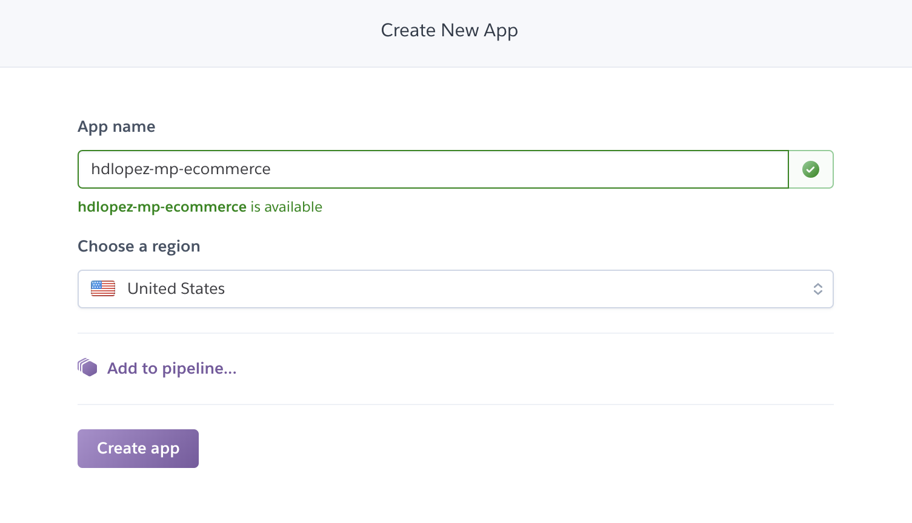
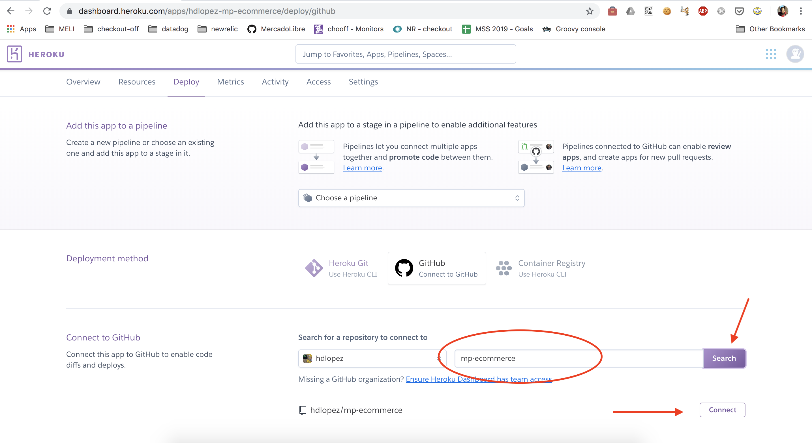
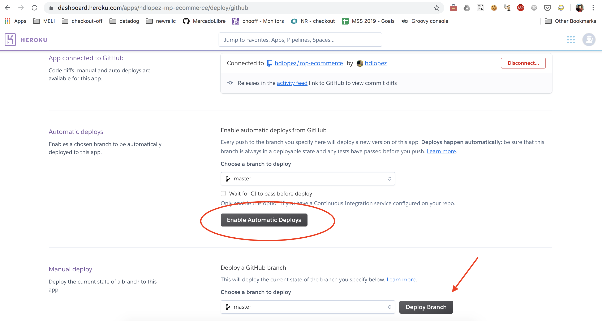

# mp-ecommerce

Este e-commerce de ejemplo será la base para la integración de MercadoPago con `php`.

## Antes de comenzar

Esta aplicación debe estar accesible mediante un dominio público en internet antes de comenzar con la integración y para ello usaremos [Heroku](https://heroku.com).

Requisitos para realizar la integración: 
* Cuenta en GitHub.
* Cuenta en [Heroku](https://heroku.com).

## Haciendo pública mi e-commerce de ejemplo

1. Realizar un fork de este proyecto. Considerando que tu usuario de GitHub es `username`, tendremos el repositorio https://github.com/username/mp-ecommerce-php
2. Ingresar a tu cuenta de Heroku
3. Crear una aplicación en Heroku para realizar el deploy de nuestro e-commerce. Nombrarla de la siguiente manera *username*-mp-commerce-php. Ejemplo:

4. Conectar a nuestra aplicación en Heroku el repositorio "forkeado" en el paso 1

5. Activar el deploy autómatico ante cualquier cambio en el branch "master". Realizar un deploy manualmente, mediante la opción "Deploy branch" para comprobar que la app esté funcionando correctamente.

6. Nuevamente considerando que tu usuario de GitHub es `username` (substituir en la URL por el correcto), acceder a https://username-mp-ecommerce-php.herokuapp.com/ y validar que la app esté corriendo. Deberás visualizar algo como lo siguiente

